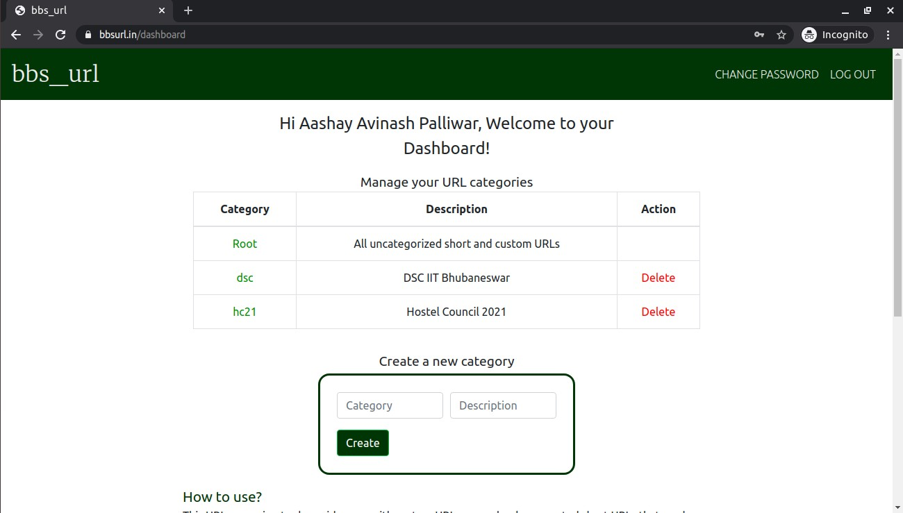
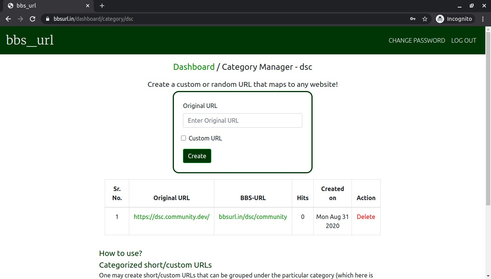

# BBS_URL

Not a conventional URL shortener. This URL management webapp is exclusively designed for the use of the societies and fests of IIT Bhubaneswar but acts as an equally good custom URL shortener for personal usage.

Besides the conventional **short and custom URLs**, the portal provides signed in users with the power to create **categorical URLs** that gives your brand or the class of URLs a **visible identity.**

**Examples of URLs:**
* bbsurl.in/G8zmgP : Randomly generated short URL
* bbsurl.in/aashay : Custom generated short URL
* bbsurl.in/neuro/fb : Custom generated categorical short URL pointing to Neuromancers' Facebook Handle
* bbsurl.in/neuro/Po8TMp : Randomly generated categorical short URL. (Category : "neuro" pointing to Neuromancers, IIT Bhubaneswar resources)

 

**[Dashboard](https://bbsurl.in)** 
 
 

 

**[Category Manager](https://bbsurl.in)** 
 
 

 

---

<h3 align="center">Feel free to contact me for discussion!</h3>

  <a href="https://aashaypalliwar.github.io/" target="_blank">Webpage</a> •
  <a href="https://bbs-underscored.github.io/" target="_blank">Blog</a> •
  <a href="https://www.linkedin.com/in/aashay-palliwar/" target="_blank">LinkedIn</a>

